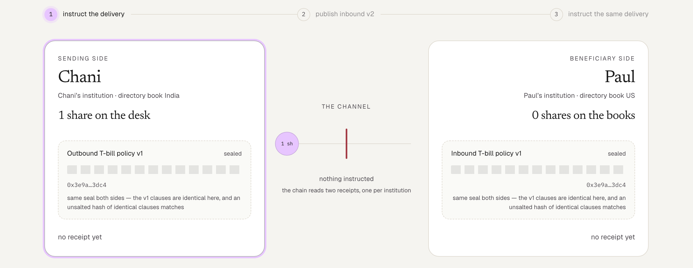
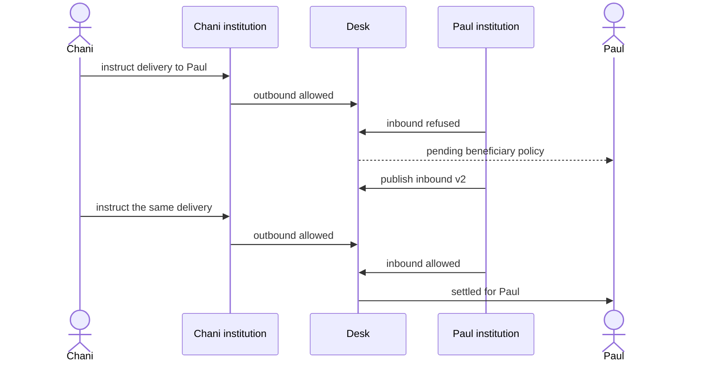
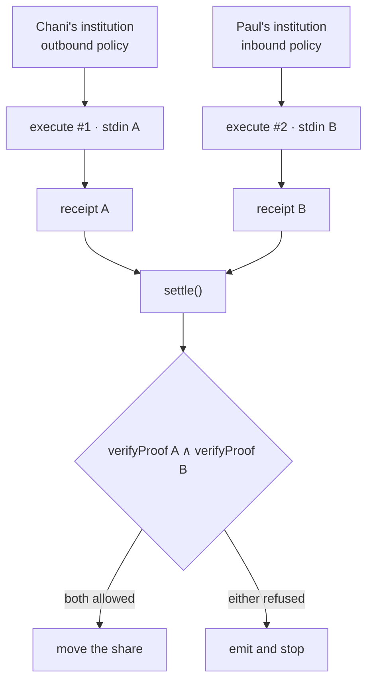
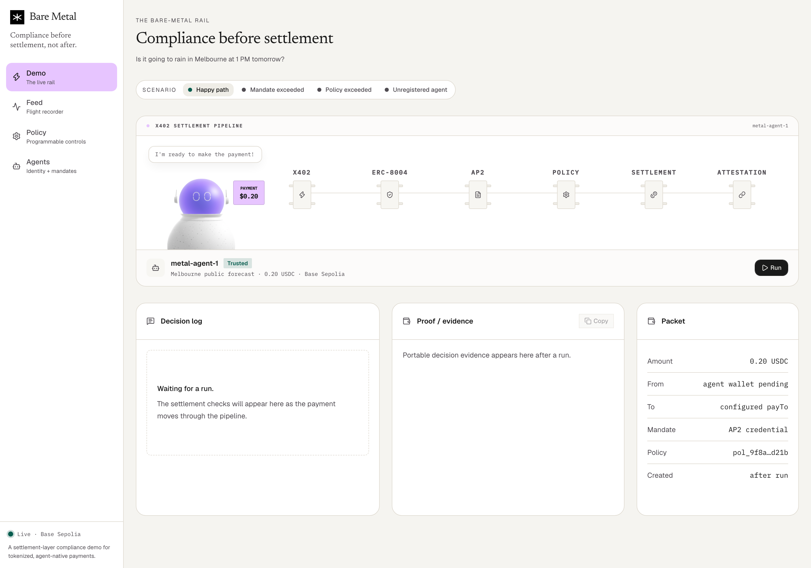
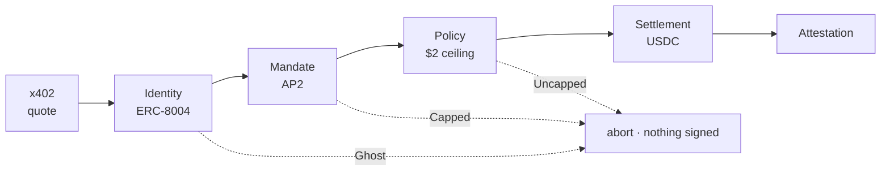
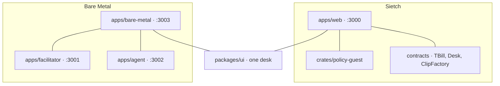

# Sietch

> **Programmable private policy at settlement**. Two institutions each prove, privately, that their own transfer policy allows a delivery. A desk on Base Sepolia moves a tokenized T-bill share only if both receipts allow. The walk below is that delivery.


**Paul** is a customer of a US institution. **Chani** is a customer of an institution in India.

Chani instructed her institution to deliver a tokenized T-bill share to Paul. Her institution allowed it. The share did not land on Paul’s books.

The delay was not the rail. It was Paul’s institution’s inbound policy: a jurisdiction label and a stub clause. The public may see which institution refused. It must not see that stub. There is no reason field, because a reason field would tell an observer which clause fired.

That is [Metal’s sentence](https://metalntwx.com/blog/hello-metal/): when a delivery does not settle instantly, it is often the beneficiary institution’s policy, and an ideal chain lets institutions enforce that as part of settlement without the network seeing the clauses. The usual answer is a private subnet. The operators see everything. That is the hole.



Beat one. Both policies are in force and neither is readable — the grey blocks are the whole argument. Both sides seal to `0x3e9a…3dc4` here only because the v1 clauses happen to be identical, which is the first known limit, on screen and admitted.

**[Walk the clip →](https://sietch-plum.vercel.app/)** · **[Then the agent →](https://metal-web.vercel.app/)**

> Unofficial work, inspired by Metal’s public thesis. Not affiliated with, endorsed by, or reviewed by Metal.

### In one screen

- **What it is.** Two institutions each prove, privately, that their own transfer policy allows a delivery. A contract on Base Sepolia moves a tokenized T-bill share only if both proofs say allow.
- **What it shows.** A delivery the sender allowed can still be refused by the beneficiary, and the chain learns *that* it was refused without learning *which clause* refused it.
- **What it costs.** About 540k gas per settlement, for two Groth16 verifies. That number is the argument, and it is the last section of this story.

Four things this demo does not do are listed under [Known limits](#known-limits). They are on the live page too.

### Words used here

| Word | Means |
|------|-------|
| **desk** | The settlement contract on Base Sepolia. It holds the share until both receipts clear. |
| **receipt** | One institution’s proof that its own policy allowed or refused this delivery. |
| **clip** | The three-beat walkthrough on the live page: refused, v2 published, settled. |
| **seal** | A hash of a policy. Commits to the policy without printing it. |
| **checkout** | This repo. Two products live in it. |

Yes, the names are from Dune. A sietch is a hidden room you are safe inside. That is the thesis in one word.

---

## The delivery

Four actors. Chani and her sending institution. Paul and his beneficiary institution. The thing moving is a toy ERC-20 T-bill share. It starts on the desk on Base Sepolia, not on Paul’s books.

Chani instructs. Each institution issues a **receipt**: a proof that its own inbound or outbound policy allowed or refused this delivery. One from Chani’s institution, one from Paul’s. `settle()` is the desk contract. It checks both receipts in a single transaction and moves the share only if both allowed.

Chani’s institution allowed. Paul’s institution refused. The share stays on the desk. Settlement did not complete, and it is waiting on the beneficiary. The page names that **settlement pending beneficiary policy**. It does not say which clause refused.

Paul’s institution then publishes inbound policy v2. Not Paul — the institution. A version is not a settlement, so the refusal stays on the transcript. History is not rewritten.

Chani instructs the **same** delivery again. New transfer id. Both institutions allow. The share posts for Paul. **Settled for Paul.**



After those three beats: a delivery Chani’s institution allows can still fail to reach Paul, the chain never prints either institution’s clauses, and the only thing published to fix it is Paul’s institution’s v2.

---

## Why two receipts

A subnet with one operator who reads both institutions’ policies recreates the hole. So one guest program runs **twice**. Each run’s private input is only that institution’s policy. Never both in one prover. The desk verifies both receipts and moves the share only if both allowed.



The guest is a tiny program. On each run it is handed **one** institution’s policy as private input. That slot is a fixed 146-byte buffer (`STDIN_LEN` in `crates/policy-guest`). Exactly one policy fits. Glue Chani’s and Paul’s together and the guest fails to decode. Isolation is that size check, not a promise in a comment.

Each receipt also names its **side** (outbound or inbound) in the public values, so Chani’s allow cannot be submitted as Paul’s. Each `transferId` can settle once, so a passing pair cannot move the share twice.

Making a receipt is the expensive step. Checking one is cheap. Groth16 proving wants a fat x86 machine: Docker, 32GB of RAM. A laptop is the wrong box, and the public page should not wait on a prover. So the four receipts this clip needs were generated **ahead of time** on a throwaway Vultr VM, with Docker wrapping locally. The JSON was copied into `artifacts/demo/`, then the instance was destroyed. Sietch does not run on Vultr. That box was a printer.

- Chani outbound, first instruct (allowed)
- Paul inbound v1 (refused)
- Chani outbound, second instruct (allowed)
- Paul inbound v2 (allowed)

Those files are the stamps. The live page never proves. It sends the two stamps for the current beat to Succinct’s Groth16 gateway on Base Sepolia (`verifyProof`, twice), then the desk transfers or stops. That check is what **instant** means. SP1 is a stand-in for a chain-native verifier; Sietch is not a blockchain, it is a settlement room plus this guest, verified on Base Sepolia.

What the chain **does** see: whether each side allowed, a seal of each policy, both institutions, the token, the amount, the transfer id, and that both receipts verified for this program.

What it **does not** see: the other institution’s clauses, which clause refused, the bytes of the policy.

Withheld from the chain is not the same as hidden. The v1 seal is enumerable — see the first known limit. Zero-knowledge here means the chain learns those public values and that they came from this guest. Parties and amount can stay public. The question is the policy paragraph, not whether a delivery happened.

---

## Known limits

The same four stubs as the live page. The clip tells the story. These four keep it honest.

**The v1 seal is enumerable.** Unsalted hash; under 200 guesses recover the clauses. `policy_commitment` in `crates/policy`; wiring it changes the vkey.

**The receipts name a demo token id.** Both receipts commit `0x3333…`, so the proof is not bound to the asset that moves. Deploy the token first, then prove against its address.

**One operator key stands in for two institutions.** One clerk signs both calls: two receipts, one machine. Stdin is still 146 bytes, so concatenating two policies is a decode error.

**Proving is precomputed, verification is live.** Four receipts were generated ahead of time; this page does not prove.

---

## What it costs, and why that is the argument

Two verifies per settlement, ~270k gas each, so **~540k gas plus the transfer**. That is the honest number for an application contract. It does not reach millions of transactions per second, or a cent or less per call.

The gap is the argument. Fold both receipts into one proof and settlement pays one verify. Put a native verifier in the protocol and the same primitive is roughly a signature check. A policy check that costs 540k gas *above* the chain will not carry institutional volume. That is why this demo stops where it stops, and why the interesting version lives in the settlement layer itself.

---

## The agent

That was one story: two institutions, two receipts, the network never gets the book.

The other product in this checkout is **Bare Metal**, and it asks a smaller, meaner question. An agent holds a mandate from its institution and wants to spend. Who says no, and when? [Live here](https://metal-web.vercel.app/).



Four agents. Two resources: a $0.20 Melbourne forecast and a $5.00 rooftop brief, both gated by x402. Six gates, and the payment is not signed until it clears them. The tabs name the failure, the Agents page names the agent; they are the same four.

**Ghost** asks for the $0.20 forecast. Ghost has a wallet and can pay. No ERC-8004 identity maps to that payer, so it is refused at the identity gate. Nothing was ever signed.

**Capped** asks for the $5.00 brief carrying an AP2 mandate for $1. The agent is real and its identity resolves. Its delegator authorized one dollar. Refused at the mandate gate.

**Uncapped** asks for the same $5.00 brief with a $10 mandate. Identity passes. The mandate permits it — the delegator did say yes to ten dollars. The institution’s ceiling is $2. Refused at the policy gate. That is Paul’s shape again: one party allowed, another refused, and the money never moved.

**Retail** asks for the $0.20 forecast with a $1 mandate. Identity, mandate, policy, settlement, all pass. USDC moves. The facilitator attests.



Same six chips as the pipeline on the page. The dotted edges are the three refusals, and all of them fall to the left of settlement.

Metal’s ideology here is the ordering: do not move funds until the gates pass. First failure aborts, and a refused payment is never signed. The agent quotes the resource, preclears it, and only then reaches for the wallet.

Now the part that differs from the clip. That $2 ceiling lives in Postgres and is editable on the Policy page. The check is ordinary code in the facilitator. The chain does not run it. Anyone on that page can see the number, and the facilitator *must* see the number or it cannot check at all. Skip the facilitator and the ceiling does not bind. Sietch hides the policy from the verifier; Bare Metal does not even try.

What *is* on chain after a pass is the USDC transfer (public) and a commitment that a decision happened (AttestationRegistryV2). The Feed’s Public view is that commitment and a time; Auditor and Institution views are the decision record, off chain. That hides the book from the event. It does not hide the book from the facilitator.

Sietch has no identity in v1. Bare Metal does. Feed, Policy, and Agents are the flight recorder, the ceiling, and who is allowed to spend. They are not the inbound stub.

Two products so each sentence stays clean. One checkout so both can be walked.

---

## What’s in this checkout



| Path | Role |
|------|------|
| `apps/web` | Sietch settlement room |
| `apps/bare-metal` | Bare Metal Demo / Feed / Policy / Agents |
| `apps/facilitator` | x402 facilitator + attestation |
| `apps/agent` | The spending agent (built on Eve) |
| `crates/policy` | Policy evaluation + seals. One institution per call |
| `crates/policy-guest` | Guest I/O. Fixed-length stdin, one policy |
| `crates/policy-program` | SP1 zkVM shell around the guest |
| `crates/prove` | Execute / Groth16 / write artifacts, isolated stdin |
| `contracts` | Foundry: `TBill.sol`, `Desk.sol`, `ClipFactory.sol` |
| `contracts/metal` | AttestationRegistry (not on the Foundry `src` path) |
| `artifacts/demo` | Committed receipts, public values, deployment record |
| `packages/ui` | shadcn/ui (`@repo/ui`). Never install components into an app |
| `packages/db` | Sietch Drizzle + Neon (`@repo/db`) |
| `packages/metal-db` | Bare Metal Drizzle (`@repo/metal-db`). Do not merge |
| `packages/metal-shared` | Bare Metal types, ABIs, mandate helpers |
| `packages/metal-scripts` | Compile / deploy / demo bootstrap |
| `docs/plans` | Design first: [`2026-08-15-sietch-design.md`](docs/plans/2026-08-15-sietch-design.md) |

Features in `apps/web` must not import each other. Compose in `app/`, or hoist to `shared/` / `packages/`. `bun run check-boundaries` enforces that.

**Requires** [Bun](https://bun.sh) `1.4.x`. Installs with anything else will fail (`only-allow bun`).

## Commands

```sh
bun install
bun run dev              # all apps
bun run build
bun run check-types
bun run check-boundaries
bun test
bun run rearm            # fresh desk, re-armed clip
bunx playwright install chromium   # once
bun run e2e
```

```sh
export PATH="$HOME/.sp1/bin:$HOME/.foundry/bin:$PATH"
cargo test --workspace
forge test --root contracts
```

Bare Metal web is port **3003**, facilitator **3001**, agent **3002**. Sietch web stays on **3000**.

```sh
turbo run dev --filter=bare-metal --filter=agent --filter=facilitator
```

## Reproducing the proofs

`cargo prove` needs the SP1 toolchain (`sp1up`). Local Groth16 wants Docker on an x86 Linux box with about 32GB of RAM. That is how this clip’s four receipts were printed. Execute-only does not need that box:

```sh
cargo run --release -p sietch-prove --bin prove-one -- chani-outbound
```

With no Groth16 backend that writes `*.execute.json` (cycle count, public values, `proof: null`). Enough to check the guest. One execute is ~25.5k cycles: this is a policy check, not a workload. Groth16 is `prove-one` on the fat machine with Docker up. Copy the JSON into `artifacts/demo/`. The live page still only verifies.

## Operating the live clip

The clip runs on a real desk and is shared: whoever clicks advances it for everyone, and a spent desk stays spent until it is re-armed. Re-arm, `SIETCH_FROM_BLOCK`, the clerk’s gas, and the faucet path are in [`docs/operating.md`](docs/operating.md).

---

Paul gets his share in the third beat. The part worth arguing about is the second one: a refusal anybody can verify and nobody can read.
