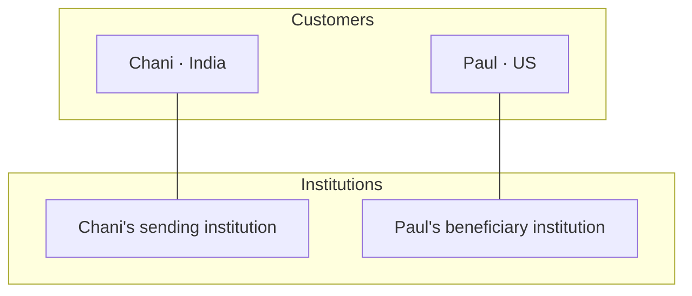
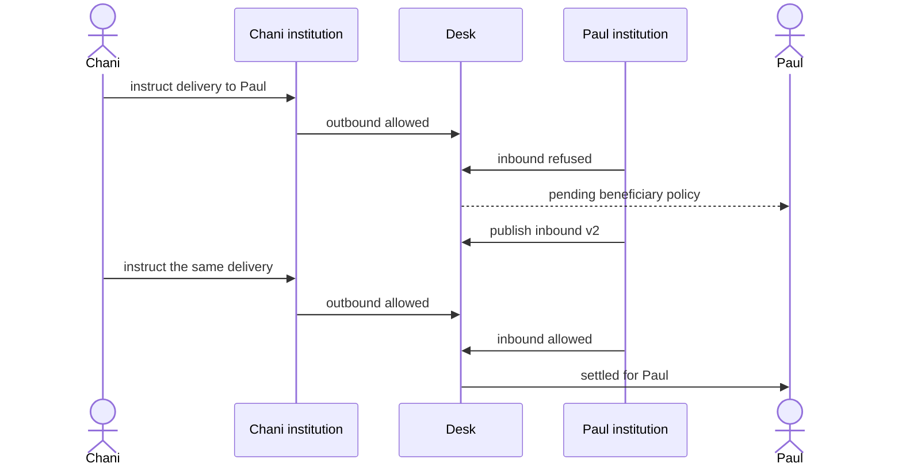
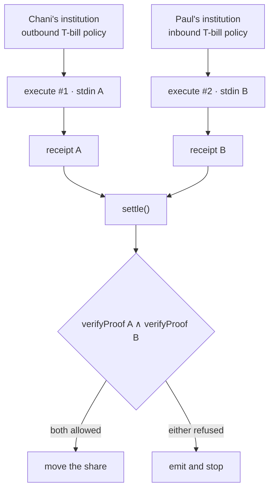
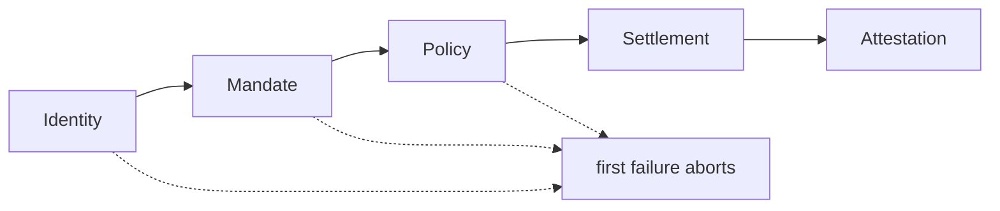
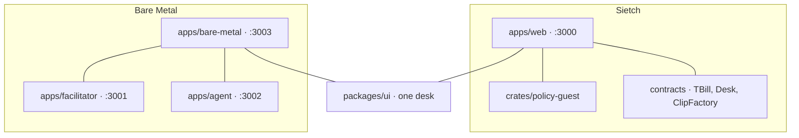

# Sietch

**Paul** is a customer of a US institution. **Chani** is a customer of an institution in India.

Chani instructed her institution to deliver a tokenized T-bill share to Paul. Her institution allowed it. The share did not land on Paul’s books.

The delay was not the rail. It was Paul’s institution’s inbound T-bill policy: a jurisdiction label and a stub clause, not real FEMA/OFAC. The public may see which institution refused. It must not see that stub. There is no reason field. That would tell an observer which clause fired.

That is [Metal’s sentence](https://metalntwx.com/blog/hello-metal/): when a delivery does not settle instantly, it is often the beneficiary institution’s policy, and an ideal chain lets institutions enforce that as part of settlement without the network seeing the clauses. The usual answer is a private subnet. The operators see everything. That is the hole.

This checkout is two stand-ins, two products, one desk. Not one homepage.

**[Walk the clip →](https://sietch-plum.vercel.app/)** · **[Then the agent →](https://metal-web.vercel.app/)**

> Unofficial work, inspired by Metal’s public thesis. Not affiliated with, endorsed by, or reviewed by Metal.

Read the four **[Known limits](#known-limits)** before the claims. They are on the live clip too.

---

## The delivery

Four actors. Chani. Her sending institution. Paul. His beneficiary institution. The thing moving is a toy ERC-20 T-bill share. It starts on a desk on Base Sepolia, not on Paul’s books.



Chani instructs. Each institution issues a **receipt**: a proof that its own inbound or outbound T-bill policy allowed or refused this delivery. One from Chani’s institution, one from Paul’s. `settle()` is the desk contract on Base Sepolia. It checks both receipts in a single transaction and moves the share only if both allowed. Chani’s institution allowed. Paul’s institution refused. The share stays on the desk. Settlement did not complete. It is waiting on the beneficiary: Paul’s institution, and its inbound T-bill policy. The page names that **settlement pending beneficiary policy**. It does not say which clause refused.

Paul’s institution publishes inbound T-bill policy v2. Not Paul. A version is not a settlement. The refusal stays on the transcript. History is not rewritten.

Chani instructs the **same** delivery again. New transfer id. Both institutions allow. The share posts for Paul. **Settled for Paul.**



After those three beats: a delivery Chani’s institution allows can still fail to reach Paul. The chain does not print either institution’s inbound or outbound T-bill policy. Only Paul’s institution publishes v2. Then it settles for Paul. A model never decided this.

---

## Why two receipts

A subnet with one operator who reads both inbound and outbound T-bill policies recreates the hole. So one guest program runs **twice**. Each run’s private input is only that institution’s policy. Never both in one prover. Same program, isolated input. The desk verifies both receipts and moves the share only if both allowed.



The guest is a tiny program. On each run it is handed **one** institution’s policy as private input. That slot is a fixed 146-byte buffer (`STDIN_LEN` in `crates/policy-guest`). Exactly one policy fits. Glue Chani’s and Paul’s together and the guest fails to decode. Isolation is that size check, not a promise in a comment.

Each receipt also names its **side** (outbound or inbound) in the public values, so Chani’s allow cannot be submitted as Paul’s. Each `transferId` can settle once, so a passing pair cannot move the share twice.

Making a receipt is the expensive step. Checking one is cheap. Groth16 proving wants a fat x86 machine: Docker, 32GB of RAM. A laptop is the wrong box, and the public page should not wait on a prover. So the four receipts this clip needs were generated **ahead of time** on a throwaway Vultr VM, with Docker wrapping locally. The JSON was copied into `artifacts/demo/`, then the instance was destroyed. Sietch does not run on Vultr. That box was a printer.

- Chani outbound, first instruct (allowed)
- Paul inbound v1 (refused)
- Chani outbound, second instruct (allowed)
- Paul inbound v2 (allowed)

Those files are the stamps. The live page never proves. It sends the two stamps for the current beat to Succinct’s Groth16 gateway on Base Sepolia (`verifyProof`, twice), then the desk transfers or stops. That check is what **instant** means. SP1 is a stand-in for a chain-native verifier. Sietch is not a blockchain. It is a settlement room plus this guest, verified on Base Sepolia.

What the chain **does** see: whether each side allowed, a seal of each policy, both institutions, the token, the amount, the transfer id, and that both receipts verified for this program.

What it **does not** see: the other institution’s clauses, which clause refused (there is no reason field), the bytes of the policy.

Withheld from the chain is not the same as hidden. The v1 seal is enumerable: see the first known limit. Zero-knowledge here means the chain learns those public values and that they came from this guest. Parties and amount can stay public. The question is the policy paragraph, not hiding that a delivery happened.

---

## Known limits

The same four stubs as the live page. The clip tells the story. These four lines keep it honest.

### The v1 seal is enumerable

Unsalted hash; under 200 guesses recover the clauses. `policy_commitment` in `crates/policy`; wiring it changes the vkey.

### The receipts name a demo token id

Both receipts commit `0x3333…`; the proof is not bound to the asset that moves. Deploy the token first, then prove against its address.

### One operator key stands in for two institutions

One clerk signs both calls; two receipts, one machine. Stdin is 146 bytes; a decode error if two policies are concatenated.

### Proving is precomputed, verification is live

Four receipts were generated ahead of time; this page does not prove. Instant means two `verifyProof` calls, roughly 540k gas.

Two verifies per settlement, ~270k gas each, so **~540k gas plus the transfer**. That is the honest number for an application contract. It does not reach millions of transactions per second, or a cent or less per call. The gap is the argument. Fold both receipts into one proof and settlement pays one verify. Put a native verifier in the protocol and the same primitive is roughly a signature check. A policy check that costs 540k gas above the chain will not carry institutional volume. That is why this demo stops where it stops, and why the interesting version lives in the settlement layer itself.

---

## The agent

That was one story: two institutions, two receipts, the network does not get the book.

The other product in this checkout is **Bare Metal**. Same type, same components. A different question. [Live](https://metal-web.vercel.app/).

An agent, carrying a mandate from its institution, tries to settle through x402 for a small USDC resource. Metal’s ideology here is the order: do not move funds until the gates pass. This repo includes a facilitator that checks identity (ERC-8004), the mandate (AP2), and a policy, then settles, then attests. First failure aborts.



This is a lab for that pipeline. It is not Metal’s chain, and it is not the private guest from the clip.

The policy is a USDC ceiling on the Policy page. It lives in Postgres. The check is ordinary code in the facilitator. The chain does not run it. Anyone on that page can see the number. The facilitator must see the number, or it cannot check. If the facilitator is skipped, the ceiling does not bind.

What *is* on chain after a pass is the USDC transfer (public) and a commitment that a decision happened (AttestationRegistryV2). The Feed’s Public view is that commitment and a time. Auditor and Institution views are the decision record off chain. That hides the book from the event. It does not hide the book from the facilitator.

Sietch has no identity in v1. Bare Metal does. Feed, Policy, and Agents are the flight recorder, the ceiling, and who is allowed to spend. They are not the inbound T-bill stub.

Two products so each sentence stays clean. One checkout so both can be walked.

```sh
turbo run dev --filter=bare-metal --filter=agent --filter=facilitator
```

Bare Metal web is port **3003**. Facilitator is **3001**. Agent is **3002**. Sietch web stays on **3000**.

---

## What’s in this checkout



| Path | Role |
|------|------|
| `apps/web` | Sietch settlement room |
| `apps/bare-metal` | Bare Metal Demo / Feed / Policy / Agents |
| `apps/facilitator` | x402 facilitator + attestation |
| `apps/agent` | Eve agent |
| `crates/policy` | Policy evaluation + seals. One institution per call |
| `crates/policy-guest` | Guest I/O. Fixed-length stdin, one policy |
| `crates/policy-program` | SP1 zkVM shell around the guest |
| `crates/prove` | Execute / Groth16 / write artifacts, isolated stdin |
| `contracts` | Foundry: `TBill.sol`, `Desk.sol`, `ClipFactory.sol` |
| `contracts/metal` | AttestationRegistry (not on the Foundry `src` path) |
| `artifacts/demo` | Committed receipts, public values, deployment record |
| `packages/ui` | shadcn/ui (`@repo/ui`). Never install components into an app |
| `packages/db` | Sietch Drizzle + Neon (`@repo/db`) |
| `packages/metal-db` | Bare Metal Drizzle (`@repo/metal-db`). Do not merge |
| `packages/metal-shared` | Bare Metal types, ABIs, mandate helpers |
| `packages/metal-scripts` | Compile / deploy / demo bootstrap |
| `docs/plans` | Design first: [`2026-08-15-sietch-design.md`](docs/plans/2026-08-15-sietch-design.md) |

Features in `apps/web` must not import each other. Compose in `app/`, or hoist to `shared/` / `packages/`. `bun run check-boundaries` enforces that.

**Requires** [Bun](https://bun.sh) `1.4.x`. Installs with anything else will fail (`only-allow bun`).

---

## Operating the clip

The live page drives a real desk. State lives on chain, so the clip is shared: whoever clicks advances it for everyone.

- **Phase is derived from contract state** (`usedTransfer`, `policyHashOf`), not from a sliding event window, so a settled desk cannot read back as fresh.
- **Set `SIETCH_FROM_BLOCK`** to the desk’s deploy block. Without it the event scan falls back to the deploy block recorded in `artifacts/demo/chain.json`.
- **A spent desk stays spent.** There is no recorded replay. Re-arm to walk it again.
- **Re-arm** deploys a **new** `TBill` and `Desk`, mints 1 share onto the desk, and stores the pointer on `ClipFactory`. Receipts bind vkey, orgs, token id, policy seals and transfer ids, **not** the desk address, so a new desk restores the clip without reproving. A new token is required because reusing the previous sTBILL would leave shares on Paul’s books.
  - **On the live page:** **Re-arm** (next to Refresh) confirms “this spends gas, tops the clerk to 0.005 ETH, and starts a new desk,” then `POST /api/clip/rearm` calls `factory.rearm()`. If the clerk cannot pay gas, the API asks Coinbase’s Base Sepolia faucet (0.0001 ETH) and retries. Uses the same `CDP_API_KEY_ID` / `CDP_API_KEY_SECRET` / `CDP_WALLET_SECRET` as Metal. Books should read 1 on the desk and 0 on Paul’s books. Refresh only re-reads chain. It does not rotate a spent desk.
  - **From this machine:** `bun run rearm` deploys the factory once, then later calls `rearm()` on it. Set `SIETCH_FACTORY_ADDRESS` on the web app (and Vercel) **once**. After that, website re-arm needs no env bump and no redeploy. **Do not walk the desk** until you are ready to show the clip.

## Reproducing the proofs

`cargo prove` needs the SP1 toolchain (`sp1up`). Local Groth16 wants Docker on an x86 Linux box with about 32GB of RAM. That is how this clip’s four receipts were printed (a throwaway Vultr VM). Execute-only does not need that box:

```sh
cargo run --release -p sietch-prove --bin prove-one -- chani-outbound
```

With no Groth16 backend that writes `*.execute.json` (cycle count, public values, `proof: null`). Enough to check the guest. One execute is ~25.5k cycles: this is a policy check, not a workload. Groth16 is `prove-one` on the fat machine with Docker up. Copy the JSON into `artifacts/demo/`. The live page still only verifies.

---

## Commands

```sh
bun install
bun run dev              # all apps
bun run build
bun run check-types
bun run check-boundaries
bun test
bun run rearm            # fresh desk, re-armed clip
bunx playwright install chromium   # once
bun run e2e
```

```sh
export PATH="$HOME/.sp1/bin:$HOME/.foundry/bin:$PATH"
cargo test --workspace
forge test --root contracts
```
